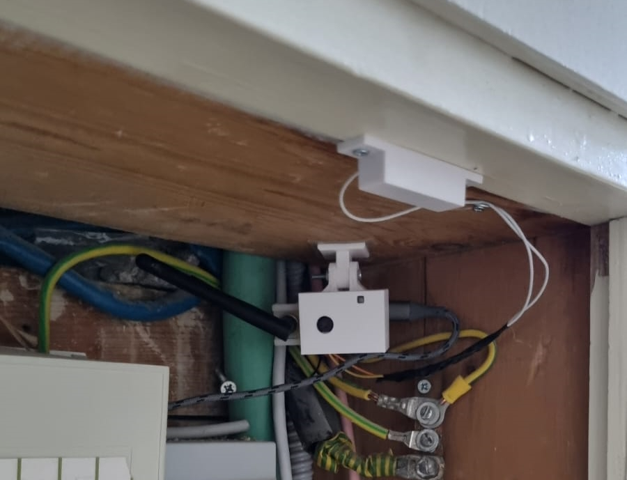

# ESP32-CAM Security Server

## Overview
`espcam-secserver` is both Python-based backend and ESP32-CAM-based security system. It uses **FastAPI** to manage HTTP requests and provides integration for multiple ESP32-CAM devices. This backend handles requests from the cameras, stores captured images, and manages a basic security system infrastructure.

## Features
- **FastAPI server**: Handles camera requests and HTTP responses.
- **ESP32-CAM integration**: Designed to work with ESP32-CAM devices for security purposes.
- **Docker support**: Run the backend easily using Docker.
- **Security-focused design**: Aimed at creating a DIY security camera system.
- **Whatsapp integration**: Send notification with images to whatsapp using [Green API](https://green-api.com/en)

## Getting Started

### Prerequisites
- Python 3.8+
- Docker
- ESP32-CAM device(s)
- Arduino Studio (IED)

